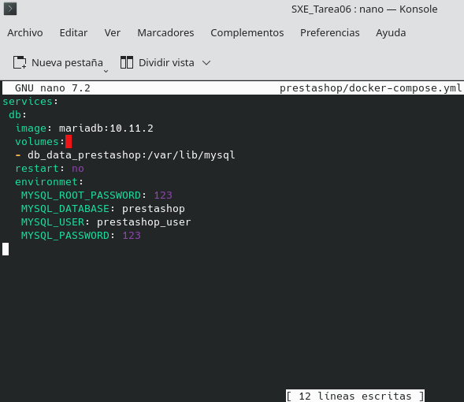

# TAREA 06 :: Docker Prestashop

## Enunciado
## 1. Crea la carpeta con docker-compose
```bash
mkdir prestashop

nano prestashop/docker-compose.yml # genera el yml para la configuración de los servicios
```

## 2. Configuración de MySQL
Dentro del archivo `.yml` se configuran los diferentes servicios como:
```bash
services: # Declara los servicios por configurar
  db:
    image: mariadb:10.11.2
    volumes:
    - db_data_prestashop:/var/lib/mysql # Volumen donde guardar los datos de la base de datos
    restart: no
    environment:
      MYSQL_ROOT_PASSWORD: 123456789
      MYSQL_DATABASE: prestashop
      MYSQL_USER: prestashop_user
      MYSQL_PASSWORD: 123456789
```
Debe quedar así:



## 3. Configuración de Prestashop en el Docker-compose 
La configuración del servicio prestashop:
```bash
 prestashop:
    depends_on: # establece la dependencia en la base de datos
      - db
    image: prestashop/prestashop:latest
    ports:
      - "9080:80"
    restart: no # always también vale perfectamente. Puse no para la primera instalación.
    environment: # variables de entorno por defecto https://hub.docker.com/r/prestashop/prestashop/
      PS_DEV_MODE: 0
      PS_HOST_MODE: 0
      PS_DEMO_MODE: 0
      DB_SERVER: db
      DB_USER: prestashop_user
      DB_PASSWD: 123
      DB_PREFIX: ps_
      DB_NAME: prestashop
      PS_LANGUAGE: en
      PS_SHOP_NAME: prueba
      PS_DOMAIN: "localhost:9080"
    networks:
      - prestashop_network
volumes:
  db_data_prestashop: # declara que el volumen va a ser accesible por todos los servicios
networks:
    prestashop_network: # declara que dicha red va a ser usada por todos los servicios
```

Debería quedar así:


## 4. Comprobación de que los servicios están arrancados y funcionando correctamente
Para lanzar los servicios:
```bash
sudo docker compose up -d # dentro de ~/prestashop donde se encuentra el yml
```
La instalación se verá así:


Y si ha ido bien: 


Para comprobar que funciona realmente, hay que acceder a `http://localhost:9080`.
**Yo, al final, le cambie el puerto a "9081". Por eso aparece así en la próxima captura de pantalla**

Esto debería aparecer:


Se selecciona el idioma para luego aceptar los terminos y el acuerdo de licencia.

Lo próximo que hay que hacer: 


Instalación de modulos:


Ahora solo queda asignar el nombre de la base de datos y las credenciales.
Estos datos son los que se pusieron en el `docker-compose.yml`.


Si todo ha ido bien, saldrá esto


Al terminar de instalar el servicio:

